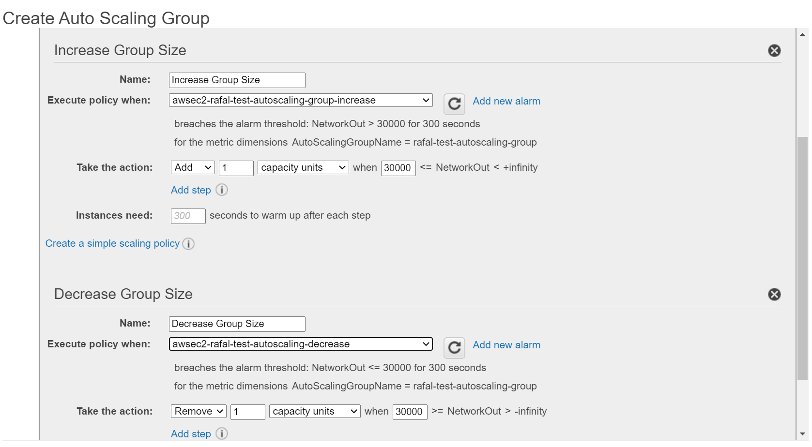

# AWS EC2 Autoscaling for Hazelcast

Hazelcast has specific requirements for the AWS EC2 Autoscaling procedure. Read more [here](https://github.com/hazelcast/hazelcast-aws#autoscaling). 

This guide presents a sequence of steps which leads to a complete autoscaling Hazelcast cluster.

## What You’ll Learn

In this guide, you'll create an AWS AMI image with Hazelcast and set up an AWS EC2 Autoscaling Group. In result, you'll have Hazelcast cluster deployed on EC2 instances which automatically scales up and down depending on specified metrics.

## Prerequisites

- ~20 minutes
- AWS account

## Create Amazon SQS (Simple Queue Service)

As the first step you need to create an SQS queue which will be used for Autoscaling Group Lifecycle Hook events. Assuming you already executed `aws configure` and set your default region to `eu-central-1`, you can execute the following command.

    aws sqs create-queue --queue-name=autoscaling-queue

You can check that the queue was created successuly at https://eu-central-1.console.aws.amazon.com/sqs.

### Create AMI (Amazon Machine Image) with Hazelcast

As the next step we need to create AWS image which will be used for the Autoscaling group.

1. Launch a new EC2 Instance "Ubuntu Server"
2. SSH into the launched instance
3. Install Hazelcast and related libraries

        sudo apt update && sudo apt install -y default-jre unzip
        sudo chmod a+wr /opt && && mkdir /opt/hazelcast && cd /opt/hazelcast
        wget https://download.hazelcast.com/download.jsp?version=hazelcast-4.0.1 -O hazelcast.zip
        unzip hazelcast.zip && rm -f hazelcast.zip
        wget https://raw.githubusercontent.com/hazelcast/hazelcast-code-samples/master/hazelcast-integration/aws-autoscaling/hazelcast.yaml
    
4. Update Hazelcast configuration `/opt/hazelcast/hazlecast.yaml` with `YOUR_AWS_ACCESS_KEY` and `YOUR_AWS_SECRET_KEY` (alternatively you can assign the needed IAM Role to the EC2 Instance)
5. Download [lifecycle_hook_listener.sh](lifecycle_hook_listener.sh)

        sudo apt install -y jq
        wget https://raw.githubusercontent.com/hazelcast/hazelcast-code-samples/master/hazelcast-integration/aws-autoscaling/lifecycle_hook_listener.sh -O /opt/lifecycle_hook_listener.sh 
        chmod +x /opt/lifecycle_hook_listener.sh
6. Install and configure AWS CLI

         sudo apt install -y awscli
         aws configure
7. Create AWS Image from the running EC2 Instance

You can check that the image was successfully created at https://eu-central-1.console.aws.amazon.com/ec2/v2/home?region=eu-central-1#Images.

## Create Auto Scaling Launch Configuration

Before you create Auto Scaling Group, you need to prepare the configuration of how you want to start EC2 Instance. Proceed with the following steps:
1. Open AWS Auto Scaling Launch Configuration console: https://eu-central-1.console.aws.amazon.com/ec2/autoscaling/home?region=eu-central-1#LaunchConfigurations
2. Click on "Create Launch configuration", select "My AMI", and choose the created image
3. In the "Create Launch Configuration" step, in the "User Data" field, add the following script

        #!/bin/bash
        export JAVA_OPTS='-Dhazelcast.config=/opt/hazelcast/hazelcast.yaml'
        /opt/hazelcast/bin/start.sh &
        /opt/lifecycle_hook_listener.sh <sqs-name>
4. Don't forget to set up the security group which allows traffic to the Hazelcast member (open port 5701)
5. Click on "Create launch configuration"

You should see that the Auto Scaling launch configuration has been created.

## Create Auto Scaling Group

Finally, you can create Auto Scaling Group with the following steps.

1. Open AWS Auto Scaling Group console: https://eu-central-1.console.aws.amazon.com/ec2/autoscaling/home?region=eu-central-1#AutoScalingGroups
2. Click "Create Auto Scaling group", select the created launch configuration, and click "Next Step"
3. Enter "Group Name", "Network", and "Subnet" and click on "Next: Configure scaling policies"
4. Configure scaling policies:
   * Select "Use scaling policies to adjust the capacity of this group"
   * Choose the max and min number of instances
   * Select "Scale the Auto Scaling group using step or simple scaling policies"
   * Choose (or create) alarms: for "Increase Group Size" and "Decrease Group Size"
   * Specify to always Add and Remove 1 instance
   
5. Click "Review" and "Create Auto Scaling group"

The Autoscaling group should be visible in the AWS console.

## Create Lifecycle Hooks

As the last step, we need to create Lifecycle Hooks. Otherwise, Hazelcast members wouldn't wait before migrating its data, so we could experience data loss.

1. Create IAM Role that is allowed to publish to SQS (for details, refer to [AWS Lifecycle Hooks, Receive Notification Using Amazon SQS](https://docs.aws.amazon.com/autoscaling/ec2/userguide/configuring-lifecycle-hook-notifications.html#sqs-notifications))
2. Check SQS ARN in SQS console: https://console.aws.amazon.com/sqs/home
3. Create Instance Launching Hook

        aws autoscaling put-lifecycle-hook --lifecycle-hook-name <launching-lifecycle-hook-name> --auto-scaling-group-name <autoscaling-group-name> --lifecycle-transition autoscaling:EC2_INSTANCE_LAUNCHING --notification-target-arn <queue-arn> --role-arn <role-arn> --default-result CONTINUE
        
4. Create Instance terminating hook

        aws autoscaling put-lifecycle-hook --lifecycle-hook-name <terminating-lifecycle-hook-name> --auto-scaling-group-name <autoscaling-group-name> --lifecycle-transition autoscaling:EC2_INSTANCE_TERMINATING --notification-target-arn <queue-arn> --role-arn <role-arn> --default-result ABANDON
        
The lifecycle hooks should be visible in the AWS console

